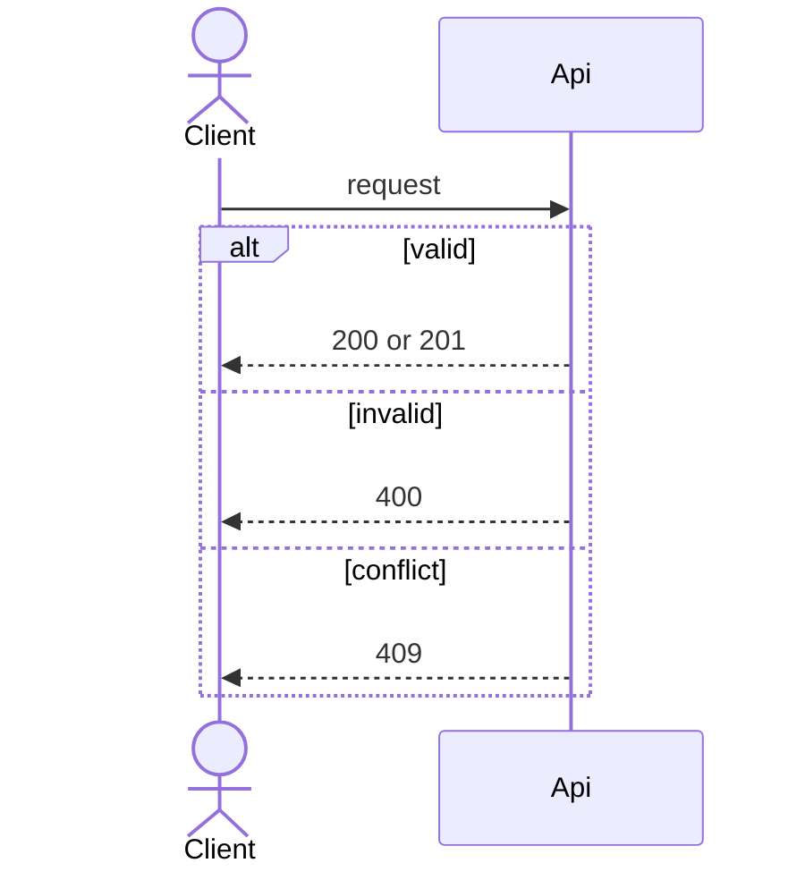

# API standards

Apply these rules when adding or changing files under `src/api/`.

## Shape

- [Resource naming]
- [Status codes]
- [Error body]

```mermaid
sequenceDiagram
  actor Client
  participant Api
  Client->>Api: request
  alt valid
    Api-->>Client: 200 or 201
  else invalid
    Api-->>Client: 400
  else conflict
    Api-->>Client: 409
  end
```
