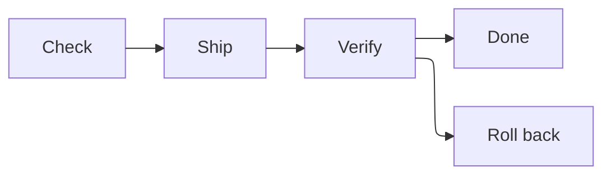

# Release runbook

Include this file on demand with `#runbook` or the `/runbook` slash command. It is not loaded automatically.

## Steps

1. [Check]
2. [Ship]
3. [Verify]

```mermaid
---
config:
  layout: elk
---
flowchart LR
  check["Check"] --> ship["Ship"]
  ship --> verify["Verify"]
  verify --> done["Done"]
  verify --> rollback["Roll back"]
```
