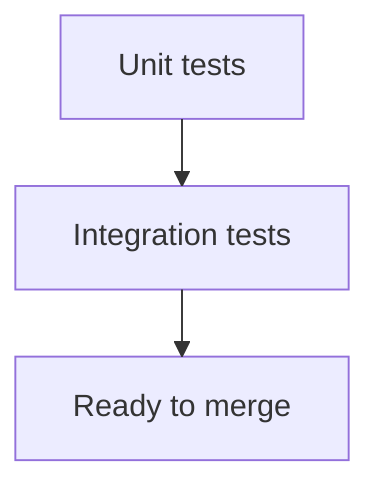

# Testing

## Layout

[Where unit and integration tests live, and how they are named.]

## Expectations

- [What a bugfix must prove]
- [What a feature task's tests must cite]

```mermaid
---
config:
  layout: elk
---
flowchart TB
  unit["Unit tests"] --> integration["Integration tests"]
  integration --> ready["Ready to merge"]
```
